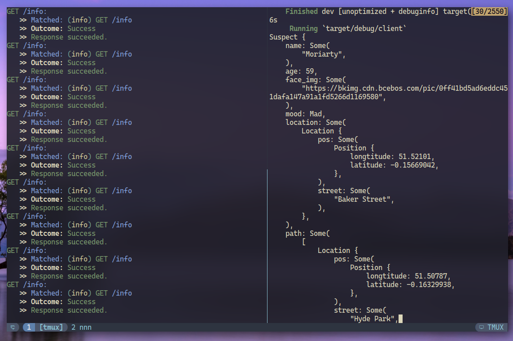

# detective

This repository use Rust to implement a HTTP server.
The server is going to use the
[Google FlatBuffers](https://google.github.io/flatbuffers/index.html)
for communicating.

## Usage

First, please ensure you have cargo 1.57 installed.

Then, run the below command to run the demo.

```bash
# first run the server
cargo run --bin server

# open a new terminal, and run the client to receive message
cargo run --bin client
```

The result looks like this:



## The design

Assuming that you are a detective.
One day you got a job, which require you to follow a suspect.
You will have a smart phone to act as the `Client` side.
And the `Server` side will continuously download satellite data.
You can download those data from `Server` and use that data to track the location
of the suspect.

Below is the data fields explanation:

- name: the suspect's name
- age: the suspect's age
- face_img: an URL to the suspect face image, you can use that to identify suspect
- mood: the suspect's current mood.
- location: the current location of the suspect
    - position: highly precise position data
      - longtitude: current longtitude value to the suspect
      - latitude: current latitude value to the suspect
    - street: the nearest street to the suspect
- path: a list of locations.
